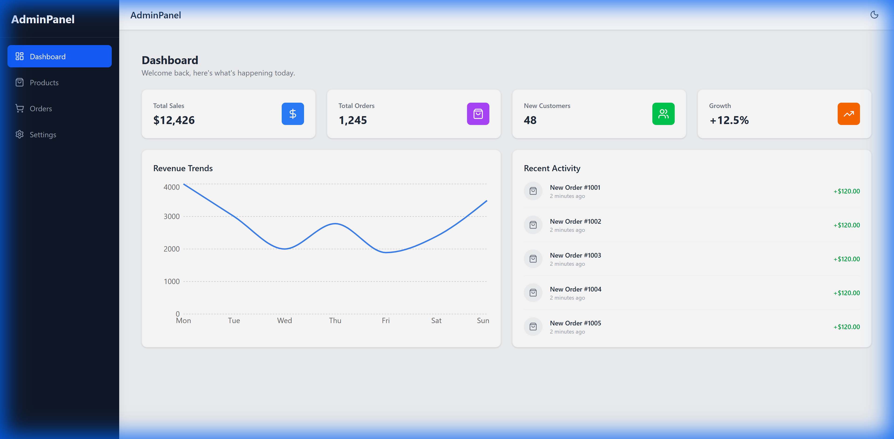

# E-Commerce Admin Dashboard

A modern, responsive admin dashboard built with React and Tailwind CSS. This project serves as a comprehensive portfolio piece demonstrating complex state management, data visualization, and responsive UI design.



## 🚀 Features

- **📊 Dashboard Overview**: Interactive revenue charts using `recharts` and key performance metrics.
- **🛍️ Product Management**:
  - Full CRUD capabilities (Create, Read, Update, Delete) for products.
  - Real-time search and category filtering.
  - Stock level indicators (Low Stock, Out of Stock, Active).
- **📦 Order Tracking**: 
  - Detailed data table with colorful status badges.
  - Filter orders by status (Completed, Pending, etc.).
- **🌓 Dark Mode**: Fully functional dark theme toggle using React Context and Tailwind's dark mode.
- **📱 Responsive Design**: Mobile-first layout with a collapsible sidebar and hamburger menu.

## 🛠️ Tech Stack

- **Framework:** [React 19](https://react.dev/)
- **Build Tool:** [Vite](https://vitejs.dev/)
- **Styling:** [Tailwind CSS v4](https://tailwindcss.com/)
- **Routing:** [React Router v7](https://reactrouter.com/)
- **Data Visualization:** [Recharts](https://recharts.org/)
- **Icons:** [Lucide React](https://lucide.dev/)

## 📦 Getting Started

Follow these steps to run the project locally.

### Prerequisites
- Node.js (v18 or higher)
- npm or yarn

### Installation

1.  **Clone the repository**
    ```bash
    git clone https://github.com/ahmadsirawan/ecommerce-dashboard.git
    cd ecommerce-dashboard
    ```

2.  **Install dependencies**
    ```bash
    npm install
    ```

3.  **Run the development server**
    ```bash
    npm run dev
    ```

4.  **Open in Browser**
    Visit `http://localhost:5173` to view the application.

## 📂 Project Structure

```bash
src/
├── components/     # Reusable UI components (StatCard, Sidebar, etc.)
├── context/        # Global state (ThemeContext)
├── layout/         # Layout wrappers (MainLayout)
├── pages/          # Page components (Dashboard, Products, Orders, Settings)
├── App.jsx         # Main router configuration
└── index.css       # Tailwind directives and global styles
```

## 🔮 Future Improvements

- [ ] **Authentication**: Add Login/Signup pages using Firebase or Supabase.
- [ ] **Backend Integration**: Connect to a real Node.js/Express API.
- [ ] **Kanban Board**: Drag-and-drop order management.

## 📝 License

This project is open source and available under the [MIT License](LICENSE).

---
*Created by Ahmad Sirawan*
